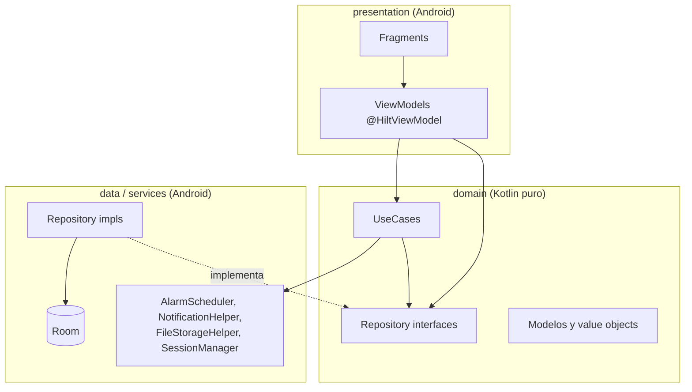

# Arquitectura

MediTrack sigue **Clean Architecture** en tres capas concéntricas, con la regla de dependencia clásica: las capas externas dependen de las internas, nunca al revés. **Hilt** actúa como composition root, cableando las implementaciones concretas en runtime.

Ver el diagrama con más detalle en [`docs/diagrams/architecture-layers.md`](../diagrams/architecture-layers.md).

## Las tres capas

### `domain/` — el núcleo

No depende de ningún framework de Android. Es Kotlin puro, testeable con JUnit sin Robolectric ni un emulador (con dos excepciones pragmáticas y deliberadas: `RegisterUserUseCase` usa `android.util.Patterns` para validar formato de email, y `SaveMedicationUseCase` recibe un `android.net.Uri` — se aceptó esa dependencia puntual en vez de introducir una abstracción extra para un caso de uso único).

- **`domain/model/`** — entidades y value objects:
  - `User`, `Medication`, `Schedule`, `MedicationLog`, `EmergencyContact`: entidades de negocio.
  - `WeekDays(days: Set<DayOfWeek>)` y `Schedule.time: LocalTime`: value objects que reemplazan los strings crudos (`"MON,TUE"`, `"08:00"`) que antes se parseaban en ~10 sitios distintos. Ver [ADR-0003](../adr/0003-value-objects-schedule.md).
  - `MedicationLogStatus`: enum con la lógica de agregación (`aggregate()`) que decide qué estado "del día" mostrar cuando un senior tiene varias dosis (MISSED > PENDING > CONFIRMED).
  - `MissedDoseAlert`, `SeniorDoseStatus`: proyecciones de solo lectura para las pantallas del cuidador (no son agregados persistidos, son *shapes* de consulta).
- **`domain/repository/`** — interfaces (`UserRepository`, `MedicationRepository`, `EmergencyContactRepository`). Los métodos de lectura reactiva devuelven `Flow<T>`; los de escritura y lectura puntual son `suspend fun`. Ver [ADR-0004](../adr/0004-flow-sobre-livedata.md).
- **`domain/usecase/`** — 9 casos de uso, cada uno con `@Inject constructor` y `operator fun invoke(...)`, sin conocer nada de Fragments/Activities. Detalle completo en [`docs/api/`](../api/README.md).

### `data/` — persistencia

- **`data/local/`**: `MediTrackDatabase` (Room), `entity/` (`UserEntity`, `MedicationEntity`, `ScheduleEntity`, `MedicationLogEntity`, `EmergencyContactEntity`), `dao/` (uno por entidad), `Converters` (enums ↔ `String`), `SessionManager` (sesión actual sobre `EncryptedSharedPreferences`, ver [ADR-0007](../adr/0007-encryptedsharedpreferences.md)).
- **`data/repository/`**: implementaciones (`UserRepositoryImpl`, `MedicationRepositoryImpl`, `EmergencyContactRepositoryImpl`) que mapean `Entity ↔ Modelo de dominio` y traducen los value objects a su representación en columna (`LocalTime ↔ "HH:mm"`, `WeekDays ↔ "MON,TUE,..."` vía extension functions en `utils/`).

Esquema completo en [`docs/database/`](../database/README.md).

### `presentation/` — UI

Un `Fragment` + un `ViewModel` por pantalla, organizados por rol (`auth/`, `patient/`, `caregiver/`, `senior/`, `camera/`). Cada `Fragment` es `@AndroidEntryPoint`; cada `ViewModel` es `@HiltViewModel` con `@Inject constructor`, tomando `SavedStateHandle` cuando necesita leer un argumento de navegación (`medicationId`, `scheduleId`, `logId`, `seniorUserId` — claves centralizadas en `NavArgKeys`) y `SessionManager` cuando necesita el usuario logueado actual.

Detalle pantalla por pantalla en [`docs/components/`](../components/README.md).

### `services/` — integraciones con el SO

No es una "cuarta capa" de Clean Architecture — son adaptadores de infraestructura que domain/usecase consume por interfaz concreta (no hay interfaz explícita para estas clases, ver [ADR-0006](../adr/0006-hilt-como-di.md) sobre por qué):

- `AlarmScheduler`: programa/cancela alarmas exactas (`AlarmManager`) y encola la verificación de dosis no confirmada (`WorkManager`).
- `NotificationHelper`: arma y dispara las notificaciones (alarma de medicación, dosis perdida).
- `FileStorageHelper`: guarda/lee/borra la foto del medicamento en almacenamiento interno de la app.
- `MedicationAlarmReceiver`, `MedicationActionReceiver`, `BootReceiver`: `BroadcastReceiver`s, todos `@AndroidEntryPoint`.
- `MissedDoseWorker`: `CoroutineWorker` `@HiltWorker`, evalúa si una dosis quedó sin confirmar 30 minutos después de la hora programada.

### `di/` — composition root

- `DatabaseModule`: provee `MediTrackDatabase` y sus 5 DAOs.
- `RepositoryModule`: `@Binds` de las 3 interfaces de dominio a sus implementaciones.
- El resto (casos de uso, `AlarmScheduler`, `FileStorageHelper`, `NotificationHelper`, los repositorios impl, `SessionManager`) se resuelve directo vía `@Inject constructor` sin necesitar un módulo explícito — Hilt sabe construirlos porque todas sus dependencias ya están resueltas.

Ver [ADR-0006](../adr/0006-hilt-como-di.md) para la decisión de usar Hilt en vez de un `AppContainer` manual.

## Flujo de datos: un ejemplo de punta a punta

**Confirmar una dosis desde la notificación** (`MedicationActionReceiver`):

1. El usuario toca "Confirmar" en la notificación → `MedicationActionReceiver.onReceive()` (Hilt inyecta `ConfirmDoseUseCase` como campo).
2. `ConfirmDoseUseCase` marca el `MedicationLog` como `CONFIRMED` vía `MedicationRepository.updateLog()`, y reprograma la siguiente ocurrencia del horario vía `AlarmScheduler.schedule()` — lo que de paso reemplaza (`ExistingWorkPolicy.REPLACE`) el `MissedDoseWorker` que estaba pendiente para esa dosis.
3. `MedicationRepositoryImpl.updateLog()` traduce el modelo de dominio a `MedicationLogEntity` y llama a `MedicationLogDao.update()`.
4. Cualquier pantalla observando `Flow<List<MedicationLog>>` (p. ej. `MedDetailViewModel.todayLogs`) recibe la actualización automáticamente — Room emite un nuevo valor en el `Flow` cuando la tabla cambia.

Diagrama de secuencia completo en [`docs/diagrams/confirmar-dosis.md`](../diagrams/confirmar-dosis.md).

## Por qué esta estructura

El proyecto no siempre tuvo esta forma. Empezó con lógica de negocio duplicada en ViewModels y Receivers, `LiveData` en el dominio, strings sin validar como `Schedule.time`, y 14 `ViewModelFactory` manuales repitiendo el mismo cableado. El refactor que llevó al estado actual se hizo en 5 fases incrementales, cada una documentada como ADR — ver [`docs/adr/`](../adr/README.md) para el detalle y el razonamiento de cada decisión.
