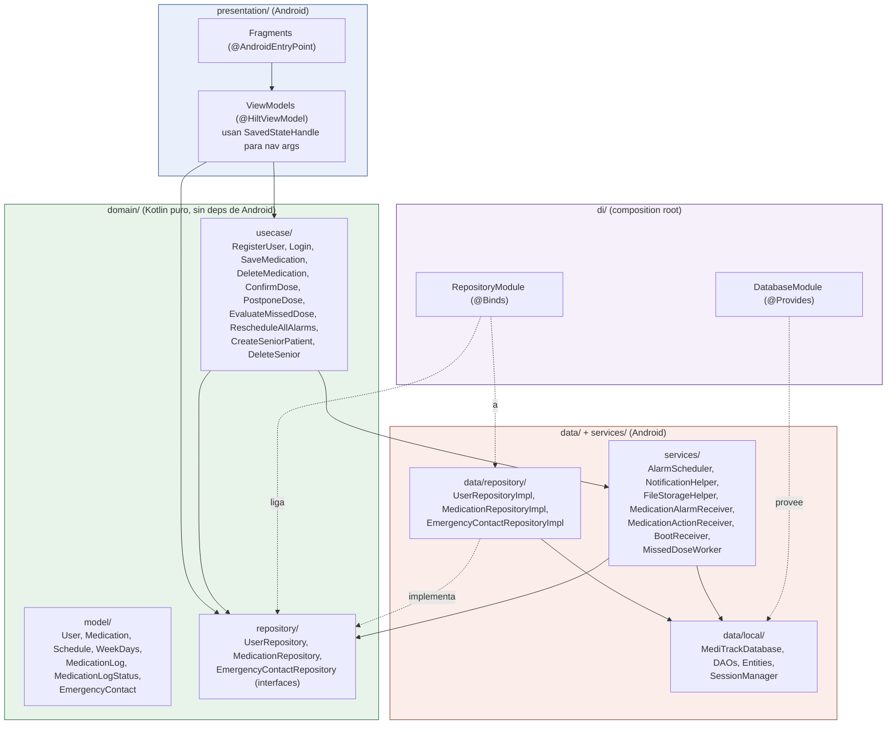

# Capas de arquitectura

Diagrama de componentes con las clases principales de cada capa. Ver [`docs/architecture/README.md`](../architecture/README.md) para la explicación en texto.

La regla de dependencia se cumple en un solo punto de fricción intencional: `domain/usecase/` importa `services/` (p. ej. `ConfirmDoseUseCase` usa `AlarmScheduler`) en vez de una interfaz. Es una desviación pragmática aceptada — ver [ADR-0006](../adr/0006-hilt-como-di.md) — porque introducir una interfaz solo para permitir un mock nunca usado en los tests reales (todos los tests de este proyecto son instrumentados contra la base real) no pagaba su complejidad.
