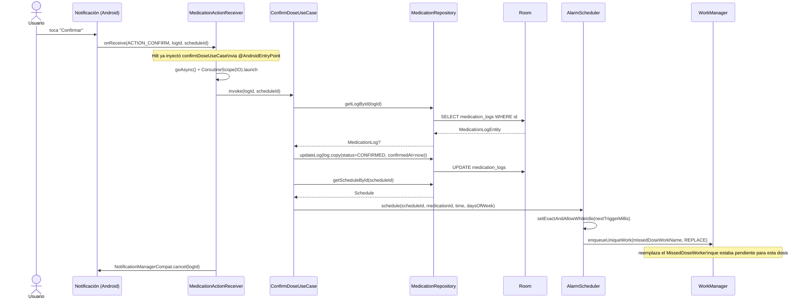

# Secuencia: confirmar una dosis

Hay dos puntos de entrada equivalentes — desde la acción de la notificación (sin abrir la app) y desde la pantalla de alerta dentro de la app — y ambos delegan en el mismo `ConfirmDoseUseCase`. El diagrama muestra el camino de la notificación, que es el más largo.

Cualquier pantalla observando `Flow<List<MedicationLog>>` (p. ej. el historial de hoy en `MedDetailViewModel`) recibe la actualización automáticamente en cuanto Room commitea el `UPDATE`, sin necesidad de refrescar manualmente.
