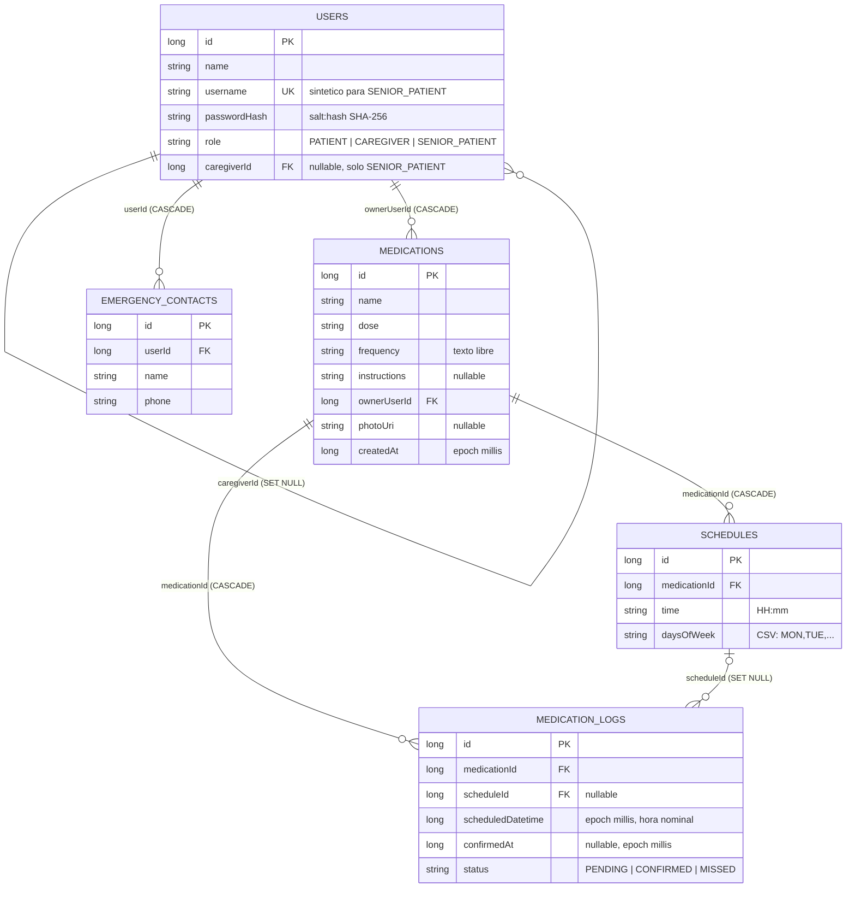

# Diagrama entidad-relación

Ver el detalle de cada columna en [`docs/database/README.md`](../database/README.md).

**Notas de cardinalidad:**

- Un `medication` puede tener **varios** `schedules` (medicamentos con más de una toma diaria).
- Cada disparo de alarma (o cada postergación) genera o reutiliza una fila en `medication_logs` — es el historial de tomas.
- `emergency_contacts.userId` es 1:1 en la práctica (a lo sumo un contacto por usuario), aunque el esquema no lo fuerza con un índice único — solo se consulta con `LIMIT 1`.
- `users.caregiverId` es la única FK auto-referencial: un `SENIOR_PATIENT` apunta a su `CAREGIVER`.
