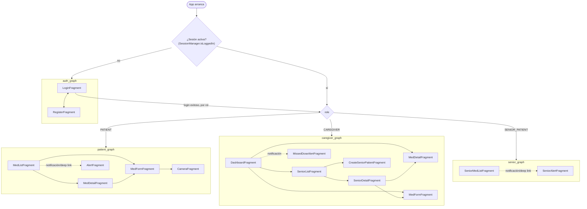

# Navegación

Un único `NavHostFragment` (`main_nav_graph`) incluye los 4 grafos por rol. `MainActivity` redirige al grafo correspondiente según el rol de la sesión activa (`SessionManager`) en el arranque en frío; dentro de cada grafo, la navegación es la estándar del Navigation Component (sin Safe Args — los argumentos van por `Bundle` con claves centralizadas en `NavArgKeys`, leídas en destino vía `SavedStateHandle`).

**Puntos clave:**

- `CameraFragment` es un destino más dentro de `patient_graph` (no un grafo incluido aparte); se comunica con `MedFormFragment` vía Fragment Result API, no vía argumentos de navegación.
- El logout (`Fragment.logout()` en `presentation/SessionNavigation.kt`, llamado desde cada pantalla raíz de rol) limpia la sesión (`SessionManager.clearSession()`) y navega de vuelta a `auth_graph` con `popUpTo` para vaciar el back stack del rol anterior.
- Las alertas de dosis (`AlertFragment` / `SeniorAlertFragment` / `MissedDoseAlertFragment`) también se alcanzan por **deep link** desde una notificación (`NotificationHelper` usa `NavDeepLinkBuilder`), no solo por navegación interna — por eso reciben su argumento (`scheduleId`/`logId`) tanto desde un `Bundle` de navegación normal como desde el intent del deep link, indistintamente (ambos terminan en `Fragment.arguments`, que es lo que lee `SavedStateHandle`).
- `SeniorDetailFragment` (dentro de `caregiver_graph`) reutiliza las mismas pantallas `MedListFragment`/`MedFormFragment`/`MedDetailFragment` de `patient_graph` — el cuidador ve/edita los medicamentos del senior con la misma UI, pasando `seniorUserId` como argumento en vez de operar sobre el usuario logueado.
